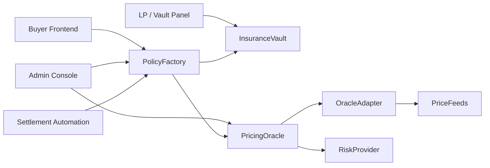
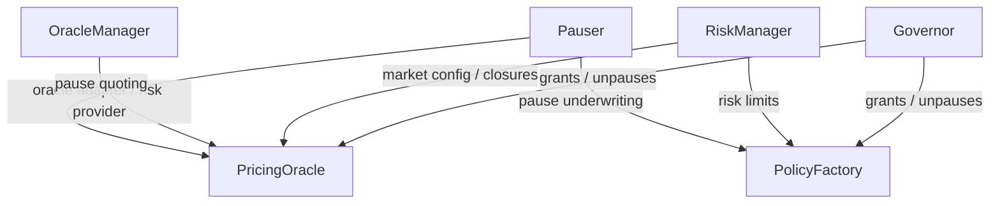

# Architecture And Defense Notes

## System Flow

## Contract Responsibilities

### `PolicyFactory`

- creates policies
- tracks lifecycle state
- enforces exposure and solvency rules
- coordinates premium collection and claim payout

### `InsuranceVault`

- stores settlement assets
- tracks LP shares
- locks and releases reserved liquidity
- accounts for realized premiums and paid claims

### `PricingOracle`

- calculates lightweight final premium quotes
- applies market-hours gating
- combines spot price with off-chain risk snapshots
- handles settlement timing rules

### `ChainlinkOracleAdapter`

- normalizes feed decimals
- validates staleness and data freshness
- supports primary/fallback oracle routing

### `MockRiskParameterProvider`

- simulates an off-chain risk engine
- stores symbol-level vol, skew, stress, and risk-score inputs

## Governance Topology

## Risk Controls

- per-symbol exposure cap
- downside vs upside exposure caps
- short / medium / long term bucket caps
- utilization ceiling
- minimum liquidity buffer
- market-hours purchase gating
- close-buffer anti-gap opening guard
- fallback oracle allowlist per market

## Current Limitations

- Hong Kong lunch break is not yet represented.
- Real production feeds are abstracted but not fully wired to live vendor credentials in-repo.
- Settlement still uses current oracle spot when the allowed settlement window is reached.
- This remains a course-project-grade derivatives MVP, not audited production infrastructure.

## Future Extensions

- full exchange holiday calendars
- Hong Kong midday recess support
- live Chainlink Functions or backend-driven risk snapshots
- indexer-backed portfolio pages
- multi-pool underwriting or segregated risk tranches
